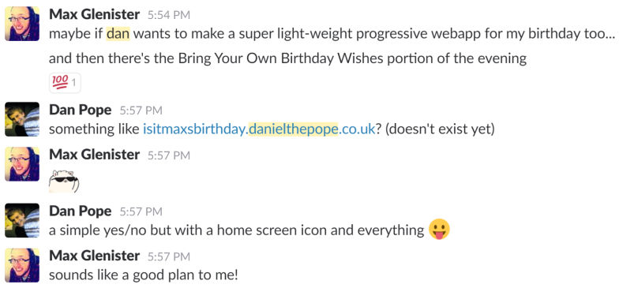
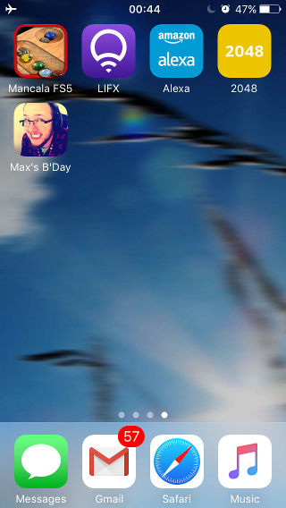
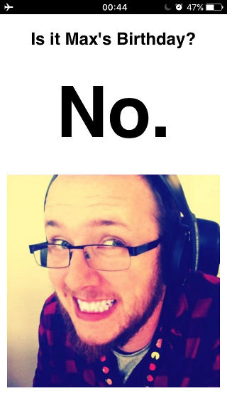

# maxsbirthday

This is a very simple PWA demo, with a picture and a bit of JavaScript.

Once upon a time, JSOxford organised a meetup that happened to be on Max's birthday. On the Slack channel Max said this:

I wasn't going to do it. Then I did it, but it took me quite a bit longer than I thought it would.

Anyway, I made this thing. The idea is you can go to that site, pin it to your homescreen, and even if you're offline, it will tell you if it's Max's birthday.

 
